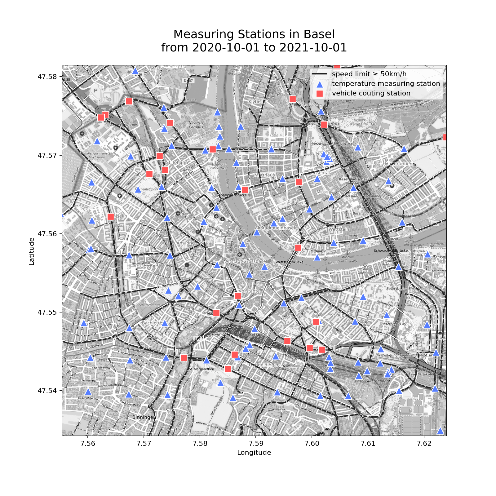

# AI4SG Project
## Group 6

 The goal of this project is to identify whether the so-called "Urban heat island phenomenon" can be observed in Basel by visualizing traffic and temperature data sets. If present, this will uncover areas of Basel that might have a lower quality of life and could possibly be improved through governmental policies.

 ---
 # Some Plots

